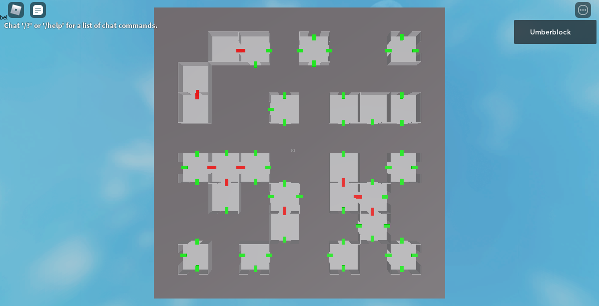

# Random Map Generator

This project was created using Lua for the language and Roblox Studio for the game engine. Most Roblox developers would create different variations of the map beforehand and randomly select one of the variations. The goal of this project is to create an algorithm to procedurally generated the layout of the maps rather than randomly selecting maps.

## Project Image with video

